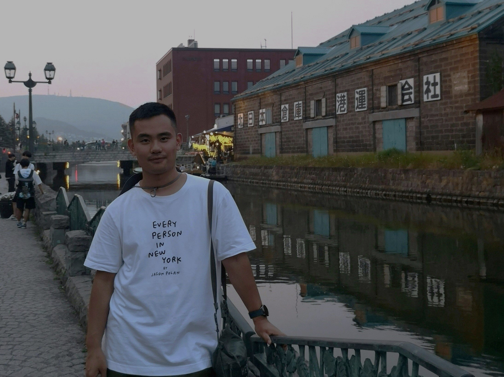

# <font face="'Consolas', 'Menlo'" color=#2f9e44>**Ke 'Kay' Fang**</font>

::::{tab-set}

:::{tab-item} <font face="'Consolas', 'Menlo'" color=#c92a2a>g</font> <font face="'Consolas', 'Menlo'" color=#a61e4d>r</font> <font face="'Consolas', 'Menlo'" color=#862e9c>e</font> <font face="'Consolas', 'Menlo'" color=#1864ab>e</font> <font face="'Consolas', 'Menlo'" color=#087f5b>t</font> <font face="'Consolas', 'Menlo'" color=#2b8a3e>i</font> <font face="'Consolas', 'Menlo'" color=#5c940d>n</font> <font face="'Consolas', 'Menlo'" color=#fcc419>g</font> <font face="'Consolas', 'Menlo'" color=#f59f00>s</font> <font face="'Consolas', 'Menlo'" color=#e67700>!</font> 

<font face="'Consolas', 'Menlo'" color=#2f9e44 size=2>let's e-meet! click the pic tab ⬆️</font>

<font face="'Consolas', 'Menlo'" color=#2f9e44 size=5>Heyy! I was wondering where you were</font> 😉

:::

:::{tab-item} <font face="'Consolas', 'Menlo'" color=#2f9e44>a pic🖼️ of me</font>

<div style="text-align: center;">
    
</div>

 <div style="text-align: center;">
    <font face="'Consolas', 'Menlo'" color=#2f9e44>The Dish📡 Stanford, Jan. 2025 (photo by Chenghao Zhou)</font>
</div>
  <script>
    // Detect dark mode and adjust the image
    function applyDarkModeFilter() {
      const img = document.getElementById('myImage');
      if (window.matchMedia && window.matchMedia('(prefers-color-scheme: dark)').matches) {
        img.style.filter = 'brightness(1)'; // Full brightness in dark mode
      } else {
        img.style.filter = 'none'; // Normal filter for light mode
      }
    }

    // Apply filter when the page loads
    applyDarkModeFilter();

    // Listen for changes in the color scheme and reapply filter
    window.matchMedia('(prefers-color-scheme: dark)').addEventListener('change', applyDarkModeFilter);
  </script>
:::

:::{tab-item} <font face="'Consolas', 'Menlo'" color=#2f9e44>explore other pages to get know me</font>
```{tableofcontents}
```
:::

::::

<font face="'Consolas', 'Menlo'" color=#2f9e44>You can call me **Kay**! My full name is **Ke Fang 方可** (in Chinese, the family name "方-Fang" comes first, my given name "可-Ke" is pronounced like "Kuh" with the third tone).</font>

<font face="'Consolas', 'Menlo'" color=#2f9e44>Starting 2024 fall, I’m a [Psychology PhD student](https://psychology.stanford.edu/people/ke-kay-fang?search=Ke%20Fang) in the cognitive area at <font color=#a44142>Stanford University</font>🌲, working with the amazing ✨[Robert Hawkins](https://rdhawkins.com/)✨ in the [Social Interaction Lab (SoIL🌱)](https://socialinteractionlab.github.io/people/).</font>

<font face="'Consolas', 'Menlo'" color=#2f9e44>Aspired to be a cognitive scientist of social minds, I'm specifically interested in computational approaches to understand how distributed individual minds support emergent collective-level behaviors and patterns such as cooperation, social norms, and polarization.</font>

<font face="'Consolas', 'Menlo'" color=#2f9e44>I did my master’s at <font color=#7b5aa6>NYU</font>🗽 with [Madalina Vlasceanu](https://climatecognition.stanford.edu/lab-members) and [Ashwini Ashokkumar](https://www.ashwinia.com/team) on social psychology. Before coming to the US, I got my bachelor of management from <font color=#518499>Lanzhou University</font>🐫 in China.</font>

<font face="'Consolas', 'Menlo'" color=#2f9e44>When not working, I usually make myself a cup of pour-over coffee (I drink hot coffee all year round) and read, and possibly try to draw some watercolors.</font>


<div style="text-align: center;">
    <font face="'Consolas', 'Menlo'" color=#2f9e44 id="lastUpdated"></font>
</div>
<script>
    // Set the last updated date
    document.addEventListener('DOMContentLoaded', function() {
        var metaTag = document.querySelector('meta[name="docbuild:last-update"]');
        if (metaTag) {
            var buildDate = metaTag.getAttribute('content');
            var lastUpdatedElement = document.getElementById('lastUpdated');
            lastUpdatedElement.textContent = 'Last updated: ' + buildDate;
        }
    });
</script>

<div style="text-align: center;">    
    <font face="'Consolas', 'Menlo'" color=#2f9e44 size=2>I recommend dark mode of the website</font>
</div>